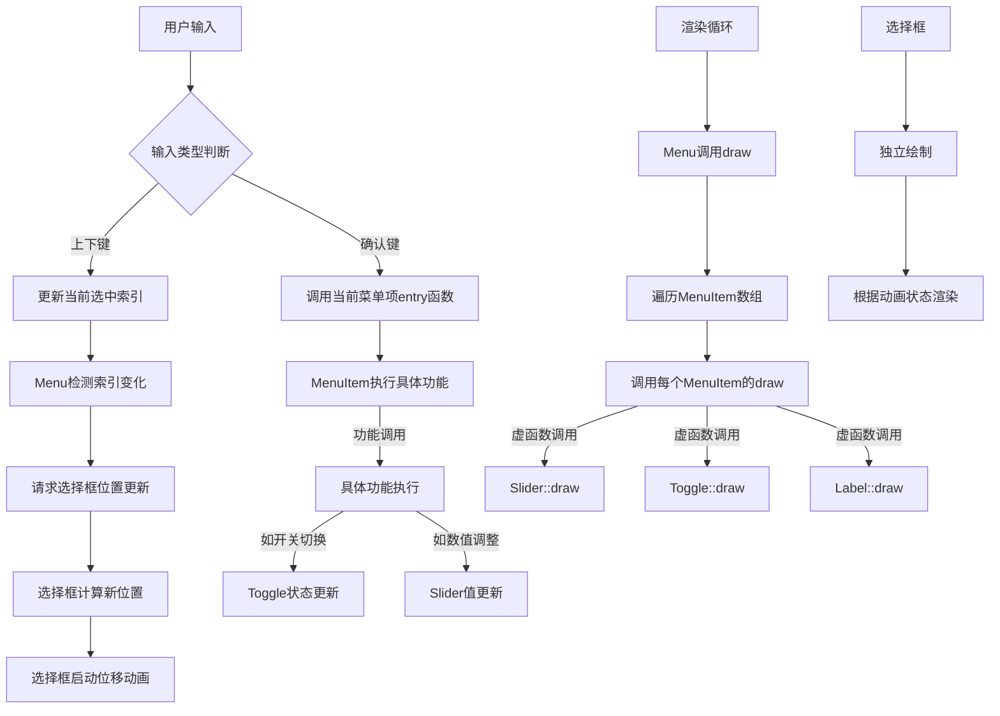
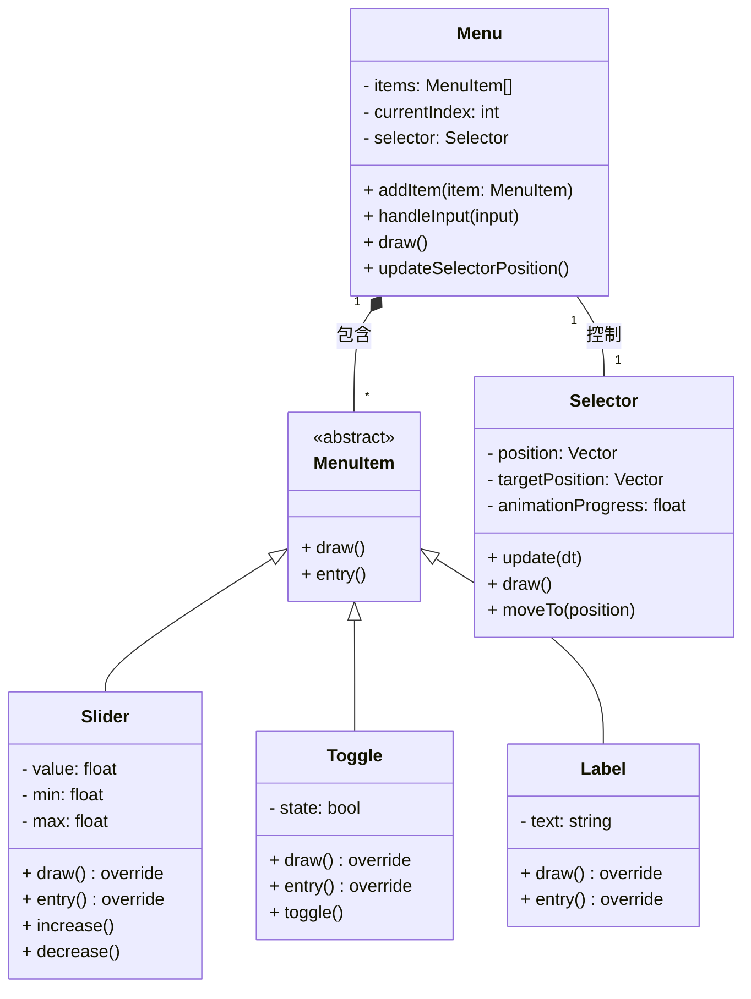
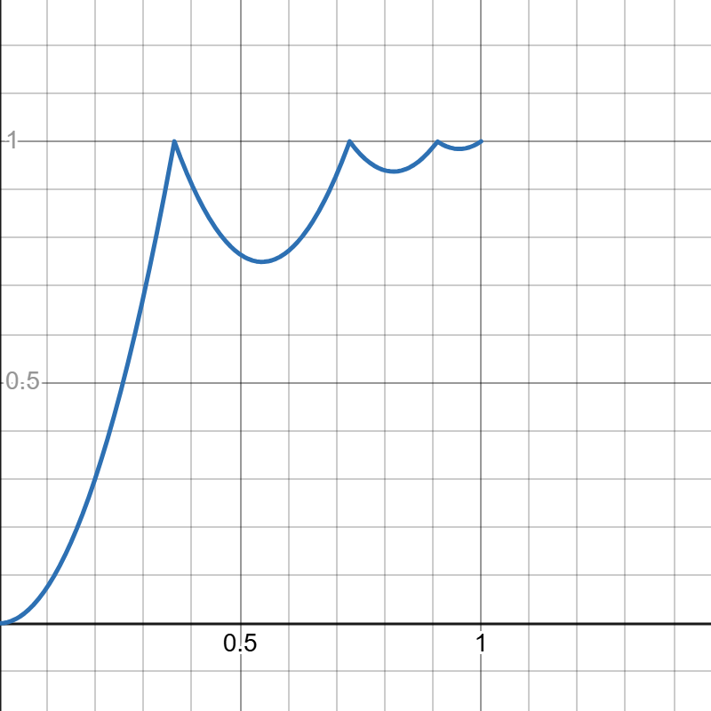
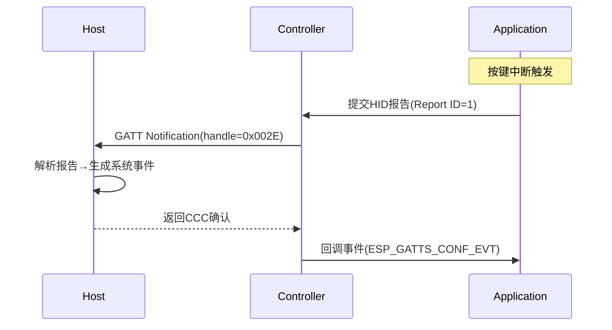
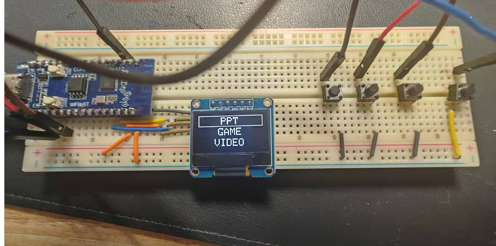
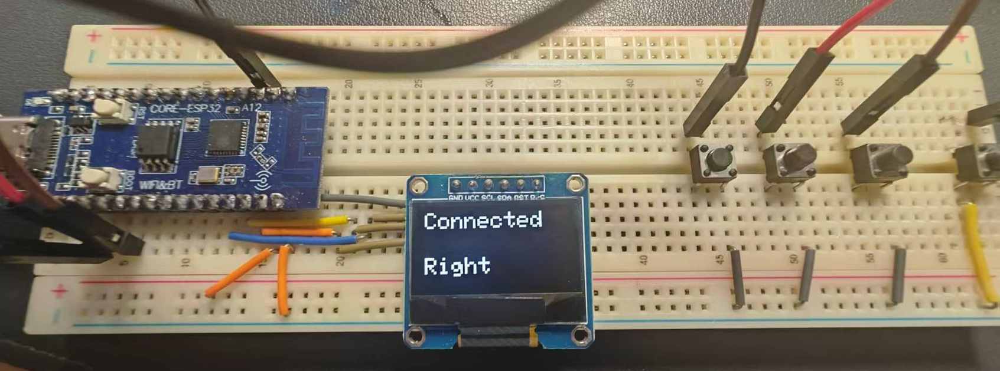
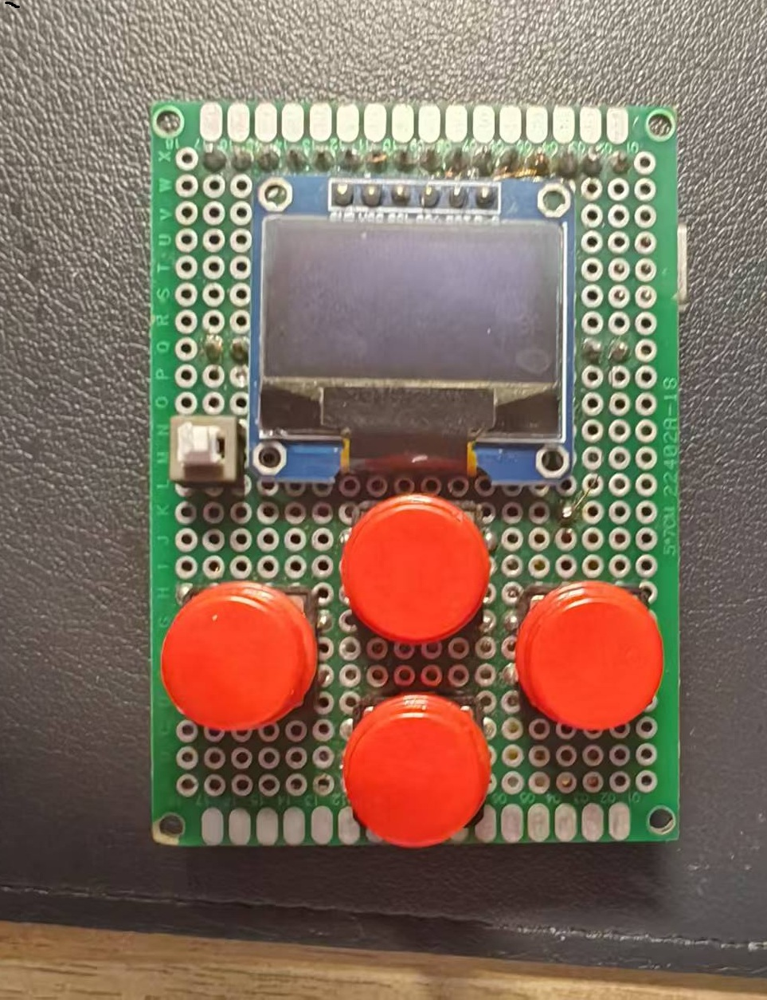
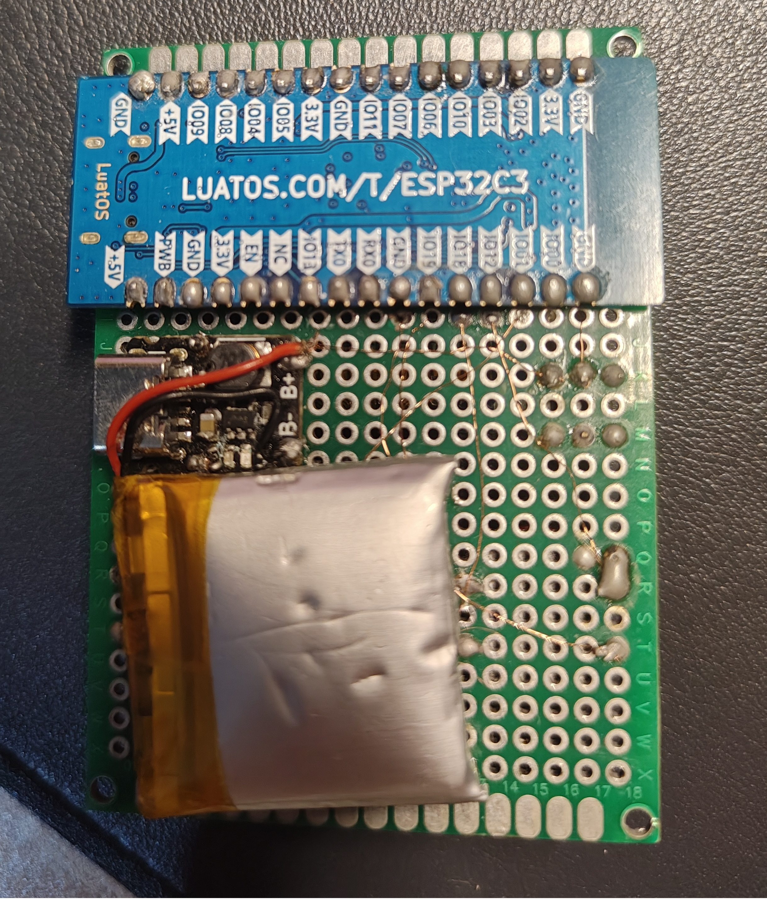

# 基于ESP32的低成本多级菜单UI系统的设计与研究
作者：徐承敏、余逸文、严慧茹
## 摘要

通过C++ OOP（*Object-Oriented Programming*）思想[^1]对菜单系统进行模块化封装，实现了成熟可用的多级菜单UI系统。并以此为基础，构建了简易的游戏模块以及翻页笔功能模块


## 引言

随着人们生活中对可移动嵌入式智能设备的需求不断升级，一套简单易用的GUI（*Graphic User Interface*）就显得愈发重要。而在众多GUI操作逻辑中，多级菜单系统以其简单的操作逻辑和较低的实现门槛而成为一种极为强大的解决方案。为了探究多级菜单背后的设计原理，我们小组展开了此次课题研究

## 软件实现

### 设计思路

对于多级菜单UI系统而言，业内已有许多成熟的解决方案，常见方案如下：

| **实现模式**        | **数据结构** | **优势**                 | **典型场景**             |
| :------------------ | :----------- | :----------------------- | :----------------------- |
| 数组查表法          | 结构体数组   | 内存占用低、逻辑简单     | 嵌入式墨水屏/OLED菜单    |
| 双向二叉树          | 树节点编码   | 升级灵活、支持双向跳转   | 需频繁修改菜单的工业设备 |
| 递归组件(Vue/React) | 多叉树       | 动态权限控制、无限层级   | 后台管理系统             |
| 状态机+ADC检测      | 事件驱动     | 实时响应、低延迟         | 旋转编码器控制的LCD菜单  |
| Ajax动态加载        | 数据库关系表 | 按需加载、减轻服务器压力 | 大型Web应用              |

而对于嵌入式设备来说[^4]，简单易用，内存占用低是核心要务。相对而言，动态增删改查以及极为复杂应用场景就并非应当考虑的了。基于嵌入式系统无需热重载的特点，我们采用了数组查表法。其核心思想如下：

将菜单抽象为 Menu，菜单选项抽象为 MenuItem 基类，对于其下的各种不同菜单选项，如滑动条（*Slider*），开关（*Toggle*），标签（*Label*），我们可以通过派生子类来进行进一步分化，使用统一的接口来控制整体行为的一致性，从而保证代码的可复用性。进一步地，Menu会将 MenuItem统一储存于数组中，通过索引（*index*）来选中当前菜单项，并通过虚函数重载（*Virtual Function Specifier*）的方式来调用 MenuItem 的 *draw()* 和 *entry()*函数来进行渲染和具体功能的调用。为了使该系统支持动画功能，又进一步将选择框（*Selector*）进行抽象，使其独立于 MenuItem 模块之外，通过 Menu 来监测整体行为的改变以进行选择框位置动态调整。通过以上方式，我们很容易对菜单系统进行扩展。而要实现无限嵌套式的菜单也极为简单，只需要在 *entry()*函数中再实例化一个 Menu即可。

其流程图演示如下：





### 具体细节

#### 编译平台

传统编译平台Arduino IDE虽然简洁易用，但是其缺点也十分显著，不支持增量编译（*Incremental Compilation*），每次编译都会将所有文件进行宏展开并置于一个临时文件中，当编译完成后又会将其删去只保留编译结果，Arduino IDE的简洁易用却是以编译速度为代价的。在该种编译方法下，每次烧录都意味着要将整个项目重新编译一遍，在一些小项目下可能印象不显著，但是当项目体积逐渐增大的情况下，编译时间成本就将变得极高，极为耽误开发周期。

因此，我们选择了*PlatformIO*平台[^5]。作为新一代开发平台，该平台为嵌入式开发提供了一套完整的解决方案，支持多种硬件架构与开发框架。我们在选择了*PlatformIO*之后，便可在现代化编译器*Visual Studio Code*上进行高效开发，大大提高了开发效率。不仅如此，*PlatformIO*直接依赖于*GCC（GNU Compiler Collection）*，可以通过增量编译的手段，只编译进行过更改的文件而不会将整个项目进行重新编译，再通过GNU ld来将更改部分与未更改部分链接（*linking*）到一起，从而实现高效编译。


#### 显示模块

采用 Adafruit-SSD1306库[]作为底层依赖，动画系统逻辑如下。

对于选择框而言，我们定义三个位置，一个是目标位置 （*target  pos*）、一个是实际位置 (*current pos*)，以及静止位置（*idle pos*）。以及动画进行程度（*progress*），通过公式 $current\_pos = idle\_pos + (target\_pos - idle\_pos) \times f(progress)$ 来构建四者关系，其中，*progress*为介于 0 到 1 之间的浮点值，用于控制动画进行程度。我们只需要控制 $f(x)$ 就能实现各种动画。

我们最终选择了如下 $f(x)$ 函数：

```math
f(x) = 
\begin{cases} 
7.5625 \times x^2 & \text{if } 0 \leq x < \dfrac{1}{2.75} \\[2ex]
7.5625 \times \left(x - \dfrac{1.5}{2.75}\right)^2 + 0.75 & \text{if } \dfrac{1}{2.75} \leq x < \dfrac{2}{2.75} \\[2ex]
7.5625 \times \left(x - \dfrac{2.25}{2.75}\right)^2 + 0.9375 & \text{if } \dfrac{2}{2.75} \leq x < \dfrac{2.5}{2.75} \\[2ex]
7.5625 \times \left(x - \dfrac{2.625}{2.75}\right)^2 + 0.984375 & \text{if } \dfrac{2.5}{2.75} \leq x \leq 1
\end{cases}
```
其图像如下：



这个函数实现了缓动效果，通过对物体弹跳这一物理运动的模拟，得以使选择框的运动十分自然流畅。

另外值得一提的是字体大小设计，我们采用动态字符宽度计算以便菜单字体能在大字和小字之间边界切换，使得其扩展更便捷，大大增强了代码的可复用性。

#### 按键模块

由于嵌入式系统，软硬件间的协调极为重要。我们采用 OneButton 库来实现对物理按钮的控制。由于在多级菜单实例中可能存在多个 menu实例，所以我们采用 *Context Passing Pattern*，以实现对各级menu的访问。

在具体功能函数下面，我们采用任务驱动模式（*Task-Based Pattern*），使之能适应按键的监听和变化。

#### 特色功能

基于实用性原则，我们在完善UI系统后，增加了游戏和控制PPT的功能，下面重点介绍控制PPT功能。

本次设计基于**ESP32-C3 Wi-Fi/BLE双模SoC**，其蓝牙子系统通过 **Bluetooth LE 5.4** 认证[^3]，支持最新核心规范：


基于此，我们可以通过蓝牙来与主机之间建立通讯，进而实现发送按键信号达到控制PPT的效果。借助于 NimBLE 框架，以及 BLEKeyboard这一强大上层库，我们得以实现蓝牙通信这一复杂流程。



下面是该系统关键性能指标：

| **参数**     | 值     | 测试条件            |
| :----------- | :----- | :------------------ |
| 按键响应延迟 | ≤18ms  | Windows 11 + BT 5.0 |
| 重连时间     | 320ms  | 从深度睡眠唤醒      |
| 数据包成功率 | 99.97% | 2米距离1000次传输   |


得益于事件驱动的设计理念，这一过程可以被大大简化，并且易于扩展。经过反复调试，本设备已实现跨端通信， 主流操作系统都可以正常与之配对（pair）并正确接收按键信息。

| **操作系统** | 版本         | 功能验证（测试版）           |
| :----------- | :----------- | :--------------------------- |
| Windows 11   | 22H2         | 全键无冲/多媒体键/休眠唤醒   |
| Ubuntu 22.04 | Kernel 6.2.0 | 终端快捷键/Caps Lock状态同步 |
| Android 13   | AOSP         | 虚拟键盘弹出/电量显示        |

## 硬件实现

本项目采用合宙ESP32-C3开发板为主体进行开发，项目硬件原理图如下：


对于按键的检测，我们并未采用硬件去抖，而是利用软件层面对其信号进行处理，简化了电路。

对于OLED，我们采用了SPI作为通信协议，兼顾高速度与低占用的需求。

### 耗材

该手持设备所用设计材料及成本如下所示：

| 材料名                | 数量 | 单价（RMB） |
| --------------------- | ---- | ----------- |
| 下拉按钮              | 5    | 0. 1        |
| 18650锂电池充放电模块 | 1    | 3.9         |
| 3.7V锂电池（400mAh）  | 1    | 4.3         |
| 合宙ESP32-C3          | 1    | 10.3        |
| OLED 0.96寸           | 1    | 10.4        |
| 总价                  |      | 29.0        |

成本在30元以内，如果进行量产则成本可以进一步降低。

### 功耗分析

本系统核心功耗源为ESP32-C3[^2]主控芯片及OLED 12864显示屏。在3.3V工作电压下：

- **ESP32-C3动态电流**：30.6 mA（射频激活状态，BLE广播+连接维持）
- **OLED 12864全显电流**：28 mA（128×64像素全点亮，对比度70%）
- **理论总功耗**：$P_{理论} = V \times I = 3.3V \times (30.6 + 28) \text{mA} = 193.38 \text{mW}$

考虑实际电路损耗，引入15%冗余系数：

- **修正总电流**：$I_{实际} = (30.6 + 28) \times 1.15 = 67.39 \text{mA}$
- **实际功耗**：$P_{实际} = 3.3V \times 67.39 \text{mA} = 222.39 \text{mW}$

| **工作模式** | ESP32-C3电流 | OLED电流 | 总电流 | 触发条件                |
| :----------- | :----------- | :------- | :----- | :---------------------- |
| **主动交互** | 30.6 mA      | 28 mA    | 65 mA  | 按键操作+蓝牙数据传输   |
| **待机显示** | 12.2 mA      | 18 mA    | 33 mA  | 屏幕常亮但无操作        |
| **轻度休眠** | 0.8 mA       | 0.5 mA   | 1.3 mA | 屏幕关闭，BLE保持连接   |
| **深度休眠** | 5 μA         | 0.1 μA   | 5.1 μA | 硬件定时唤醒（RTC模式） |

采用400mAh锂聚合物电池（标称电压3.7V），考虑放电曲线非线性特性：

- **有效容量**：$C_{eff} = 400 \text{mAh} \times \eta_{DC-DC} \times \eta_{bat} = 400 \times 0.85 \times 0.9 = 306 \text{mAh}$
  （其中η<sub>DC-DC</sub>为LDO转换效率，η<sub>bat</sub>为电池放电深度系数）

按用户行为模型（40%主动交互+30%待机显示+30%轻度休眠）加权平均：

- **综合电流**：$I_{avg} = 65 \times 0.4 + 33 \times 0.3 + 1.3 \times 0.3 = 35.29 \text{mA}$
- **理论续航**：$T = \frac{C_{eff}}{I_{avg}} = \frac{306 \text{mAh}}{35.29 \text{mA}} = 8.67 \text{小时}$

### 成品

为了方便调试开发，我们采用了面包板来快速搭建开发环境

如下是成品展示





在此基础上，我们又在双面洞洞板上焊接了一个袖珍版设备，尺寸仅为5cm*7cm，可以轻松放置于掌心。




## 展望

事实上基于本项目可以再进一步加入更多功能。UI方面，可以再增加瀑布式滚动动画，使得画面更为流畅。而且也可以增加其他组件，如下拉菜单，勾选栏等。更进一步地，也许还可以适配更多的显示屏设备，增强代码的可复用性。事实上，由于屏幕尺寸原因，我们无法对UI进行中文适配，如果可以，可以进一步完善字体模块。而在功能方面，可能可以进一步改进完善PPT控制功能。如使用MPU-6050整合性六轴运动处理组件，通过检测使用者手势动作来实现翻页功能，从而免去了对按键的依赖。并且ESP32-C3自带网络模块，这也就意味着可以借此实现IoT（*Internet of Things*）功能，使该设备进一步成为一个无线终端，用以控制各设备，如台灯、窗帘、空调等。所以，该课题研究也具有现实意义，相当于是构建了一个低成本的基本雏形，剩余的功能只需要在软件方面完善即可，可扩展性较强。


## 最后

本次课题研究代码全部开源，可以通过https://github.com/flyingpig233-cpu/oled_menu来查看。

## 致谢

本课题及论文的顺利完成，并非我一己之功。在此，我谨向所有在此过程中给予我无私帮助和支持的老师、同学、家人和朋友致以最诚挚的谢意。

首先，我衷心感谢我的指导老师——倪东标老师。从课题的选题立意、方案论证，到最终的实现与撰写，他都倾注了大量心血。老师总能以他渊博的知识和丰富的经验为我指点迷津，拨云见日。他严谨的治学态度、一丝不苟的科研精神使我终身受益。

感谢学校为我提供了先进的实验平台和良好的学习环境。实验室的示波器、逻辑分析仪等设备为本次研究的性能测试与数据分析提供了不可或缺的物质保障。

特别感谢我的家人。你们是我最坚实的后盾，感谢你们多年来毫无保留的支持与鼓励，感谢你们在我遇到挫折时给予的包容与理解，你们无私的爱是我不断前行的最大动力。

除此之外，还应感谢网友**27Onion**，是她的帮助使得论文得以落地。

谨此致谢！

[^1]: Gamma E, Helm R, Johnson R, et al. *Design patterns: elements of reusable object-oriented software*[M]. Boston: Addison-Wesley, 1994.

[^2]: Espressif Systems. *ESP32-C3 Series Datasheet*[EB/OL].
[^3]: Bluetooth Special Interest Group (SIG). *Bluetooth Core Specification Version 5.4*[S/OL].
[^4]: 王瑞锦, 王伟, 张永清, 等. 基于模型驱动的嵌入式GUI系统设计[J]. 计算机工程, 2021, 47(8): 230-235.
[^5]: PlatformIO. *PlatformIO Documentation*[EB/OL]. https://docs.platformio.org/
[^6]: Adafruit Industries. *Adafruit GFX Graphics Library*[EB/OL]. https://github.com/adafruit/Adafruit-GFX-Library
