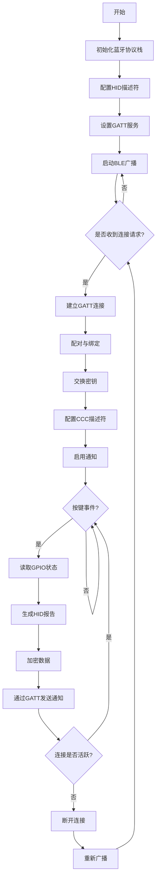

# 基于ESP32的低成本多级菜单UI系统的设计与研究

## 摘要

通过C++ OOP思想对菜单系统进行模块化封装，实现了成熟可用的多级菜单UI系统。并以此为基础，构建了简易的游戏模块以及翻页笔功能模块

## 引言

随着人们生活中对可移动嵌入式智能设备的需求不断升级，一套简单易用的GUI（Graphic User Interface）就显得愈发重要。而在众多GUI操作逻辑中，多级菜单系统以其简单的操作逻辑和较低的实现门槛而成为一种极为强大的解决方案。为了探究多级菜单背后的设计原理，我们小组展开了此次课题研究

## 软件实现

### 设计思路

对于多级菜单UI系统而言，业内已有许多成熟的解决方案，常见方案如下：

| **实现模式**        | **数据结构** | **优势**                 | **典型场景**             |
| :------------------ | :----------- | :----------------------- | :----------------------- |
| 数组查表法          | 结构体数组   | 内存占用低、逻辑简单     | 嵌入式墨水屏/OLED菜单    |
| 双向二叉树          | 树节点编码   | 升级灵活、支持双向跳转   | 需频繁修改菜单的工业设备 |
| 递归组件(Vue/React) | 多叉树       | 动态权限控制、无限层级   | 后台管理系统             |
| 状态机+ADC检测      | 事件驱动     | 实时响应、低延迟         | 旋转编码器控制的LCD菜单  |
| Ajax动态加载        | 数据库关系表 | 按需加载、减轻服务器压力 | 大型Web应用              |

而对于嵌入式设备来说，简单易用，内存占用低是核心要务。相对而言，动态增删改查以及极为复杂应用场景就并非应当考虑的了。基于嵌入式系统无需热重载的特点，我们采用了数组查表法。其核心思想如下：

将菜单抽象为 `Menu`，菜单选项抽象为 `MenuItem` 基类，对于其下的各种不同菜单选项，如滑动条（Slider），开关（Toggle），标签（Label），我们可以通过派生子类来进行进一步分化，使用统一的接口来控制整体行为的一致性，从而保证代码的可复用性。进一步地，`Menu`会将 `MenuItem`统一储存于数组中，通过索引（index）来选中当前菜单项，并通过虚函数重载（Virtual Function Specifier）的方式来调用 `MenuItem` 的 `draw()` 和 `entry()`函数来进行渲染和具体功能的调用。为了使该系统支持动画功能，又进一步将选择框（Selector）进行抽象，使其独立于 `MenuItem` 模块之外，通过 `Menu` 来监测整体行为的改变以进行选择框位置动态调整。通过以上方式，我们很容易对菜单系统进行扩展。而要实现无限嵌套式的菜单也极为简单，只需要在 `entry()`函数中再实例化一个 `Menu`即可

其流程图演示如下：

### 具体细节

#### 编译平台

传统编译平台Arduino IDE虽然简洁易用，但是其缺点也十分显著，不支持增量编译（Incremental Compilation），每次编译都会将所有文件进行宏展开并置于一个临时文件中，当编译完成后又会将其删去只保留编译结果，Arduino IDE的简洁易用却是以编译速度为代价的。在该种编译方法下，每次烧录都意味着要将整个项目重新编译一遍，在一些小项目下可能印象不显著，但是当项目体积逐渐增大的情况下，编译时间成本就将变得极高，极为耽误开发周期。

因此，我们选择了*PlatformIO*平台。作为新一代开发平台，该平台为嵌入式开发提供了一套完整的解决方案，支持多种硬件架构与开发框架。我们在选择了*PlatformIO*之后，便可在现代化编译器*Visual Studio Code*上进行高效开发，大大提高了开发效率。不仅如此，*PlatformIO*直接依赖于*GCC（GNU Compiler Collection）*，可以通过增量编译的手段，只编译进行过更改的文件而不会将整个项目进行重新编译，再通过GNU ld来将更改部分与未更改部分链接（linking）到一起，从而实现高效编译。

#### 文件布局

#### 显示模块

采用 `Adafruit-SSD1306`库作为底层依赖，动画系统逻辑如下。

对于选择框而言，我们定义三个位置，一个是目标位置 （*target  pos*）、一个是实际位置 (*current pos*)，以及静止位置（*idle pos*）。以及动画进行程度（*progress*），通过公式 $ current\_pos = idle\_pos + (target\_pos - idle\_pos) \times f(progress)$ 来构建四者关系，其中，`progress`为介于 0 到 1 之间的浮点值，用于控制动画进行程度。我们只需要控制 $ f(x) $ 就能实现各种动画。

我们最终选择了如下 $f(x)$ 函数：

$$
f(x) = 
\begin{cases} 
7.5625 \times x^2 & \text{if } 0 \leq x < \dfrac{1}{2.75} \\[2ex]
7.5625 \times \left(x - \dfrac{1.5}{2.75}\right)^2 + 0.75 & \text{if } \dfrac{1}{2.75} \leq x < \dfrac{2}{2.75} \\[2ex]
7.5625 \times \left(x - \dfrac{2.25}{2.75}\right)^2 + 0.9375 & \text{if } \dfrac{2}{2.75} \leq x < \dfrac{2.5}{2.75} \\[2ex]
7.5625 \times \left(x - \dfrac{2.625}{2.75}\right)^2 + 0.984375 & \text{if } \dfrac{2.5}{2.75} \leq x \leq 1
\end{cases}
$$
其图像如下：

这个函数实现了缓动效果，通过对物体弹跳这一物理运动的模拟，得以使选择框的运动十分自然流畅。

另外值得一提的是字体大小设计，我们采用动态字符宽度计算以便菜单字体能在大字和小字之间边界切换，使得其扩展更便捷，大大增强了代码的可复用性。

#### 按键模块

由于嵌入式系统，软硬件间的协调极为重要。我们采用 `OneButton`库来实现对物理按钮的控制。由于在多级菜单实例中可能存在多个 `menu`实例，所以我们采用 *Context Passing Pattern*，以实现对各级`menu`的访问。

在具体功能函数下面，我们采用任务驱动模式（*Task-Based Pattern*），使之能适应按键的监听和变化。

#### 特色功能

基于实用性原则，我们在完善UI系统后，增加了游戏和控制PPT的功能，下面重点介绍控制PPT功能。

本次课题基于ESP32-C3芯片。ESP32-C3 支持蓝牙 5.0 (LE)，并且已经获得蓝牙 LE 5.4 认证。

基于此，我们可以通过蓝牙来与主机之间建立通讯，进而实现发送按键信号达到控制PPT的效果。借助于 `NimBLE`框架，以及 `BLEKeyboard`这一强大上层库，我们得以实现蓝牙通信这一复杂流程。

得益于事件驱动的设计理念，这一过程可以被大大简化，并且易于扩展。经过反复调试，本设备已实现跨端通信， Windows、Linux、Android 设备都可以正常与之配对（pair）并正确接收按键信息。

## 硬件实现

本项目采用合宙ESP32-C3开发板为主体进行开发，项目硬件原理图如下

### 耗材

该手持设备所用设计材料及成本如下所示：

| 材料名                | 数量 | 单价（RMB） |
| --------------------- | ---- | ----------- |
| 下拉按钮              | 5    | 0. 1        |
| 18650锂电池充放电模块 | 1    | 3.9         |
| 3.7V锂电池（400mAh）  | 1    | 4.3         |
| 合宙ESP32-C3          | 1    | 10.3        |
| OLED 0.96寸           | 1    | 10.4        |
| 总价                  |      | 29.0        |

成本被控制在了30元以内，如果进行量产则成本可以进一步降低。

### 功耗分析

OLED12864以及ESP32-C3都属于低功耗设备，在3.3V的下，ESP32-C3工作电流约为30.6mA，而OLED12864工作电流约为28mA，一共约为58.6mA。考虑实际硬件损耗，我们将总电流估计为65mA。在总电流估计为65 mA，电池容量400mAh且满载运行的条件下，系统大约能运行约6小时，足以应对大部分场景。

### 成品

为了方便调试开发，我们采用了面包板来快速搭建开发环境

如下是成品展示

在此基础上，我们又在双面洞洞板上焊接了一个袖珍版设备，尺寸仅为5cm*7cm，可以轻松放置于掌心。

## 展望

事实上基于本项目可以再进一步加入更多功能。UI方面，可以再增加瀑布式滚动动画，使得画面更为流畅。而且也可以增加其他组件，如下拉菜单，勾选栏等。更进一步地，也许还可以适配更多的显示屏设备，增强代码的可复用性。事实上，由于屏幕尺寸原因，我们无法对UI进行中文适配，如果可以，可以进一步完善字体模块。而在功能方面，可能可以进一步改进完善PPT控制功能。如使用MPU-6050整合性六轴运动处理组件，通过检测使用者手势动作来实现翻页功能，从而免去了对按键的依赖。并且ESP32-C3自带网络模块，这也就意味着可以借此实现IoT（Internet of Things）功能，使该设备进一步成为一个无线终端，用以控制各设备，如台灯、窗帘、空调等。所以，该课题研究也具有现实意义，相当于是构建了一个低成本的基本雏形，剩余的功能只需要在软件方面完善即可，可扩展性较强。

